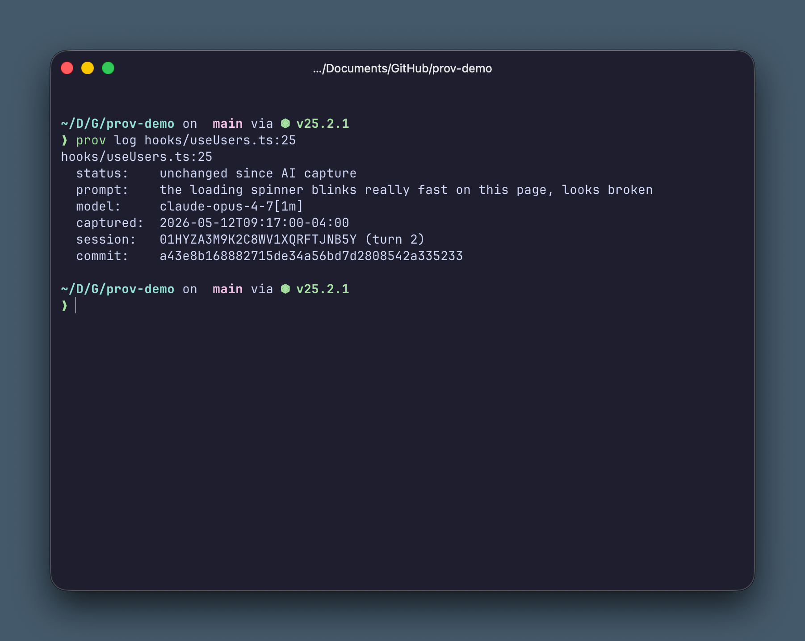
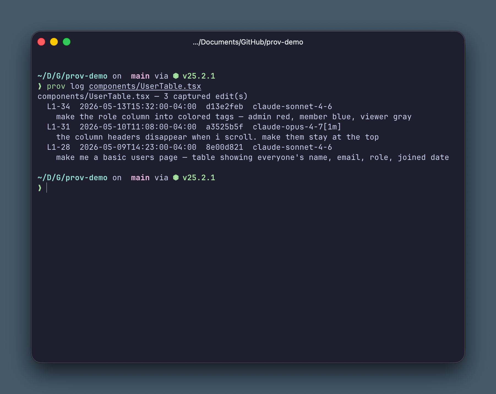

# prov

[](https://github.com/mattfogel/prov/actions/workflows/ci.yml)
[](#license)

> Git blame tells you who. Prov tells you why.





Prov captures the prompt-and-conversation context behind AI-agent-driven edits, attaches it to commits via git notes, and exposes it through thin read surfaces:

- **CLI** for humans — `prov log src/auth.ts:42` returns the originating prompt for any line.
- **Agent skills and hooks** for supported harnesses — Claude Code and Codex capture provenance automatically during sessions, and an agent skill teaches the agent to answer the user's provenance questions ("why does this do X", "what was the prompt that wrote this", "what's the history of this file") on demand.

## How it works

Prov sits at three points in a normal developer workflow:

1. **Agent harness hooks** (Claude Code, Codex) record the prompt and the assistant's reasoning when an agent runs a file-modifying tool. The conversation snapshot is staged in `<git-dir>/prov.db`.
2. **Git hooks** (`post-commit`, `post-rewrite`, `pre-push`) attach the staged context to the resulting commit as a git note on a dedicated ref, migrate notes through rebases/amends, and run a secret-detector pre-push gate.
3. **Read surfaces** (`prov log`, `prov search`, agent skill) read the notes ref and the local SQLite cache to answer "why does this line exist?"

Notes live under `refs/notes/prompts` (shared) and `refs/notes/prompts-private` (local-only). Out of the box, nothing leaves your machine.

## Install

Until the first tagged release ships, install from source:

```bash
cargo install --git https://github.com/mattfogel/prov prov
```

## Quick start

```bash
# In any git repo, install the git hooks and SQLite cache:
prov install

# Then explicitly wire whichever agent harness you use:
prov install --agent claude
prov install --agent codex
# or: prov install --agent all

# Restart/reopen the harness so it picks up repo-local hook config.
# Run an agent session, make some edits, commit. Then:
prov log src/auth.ts                 # provenance for the whole file
prov log src/auth.ts:42              # the originating prompt for one line
prov search "rate limiting"          # find prompts that mention rate limiting
```

Optional: install the agent skill so Claude Code (or any harness that supports Anthropic-style Skills) can answer provenance questions directly in the session — "why does this line do X", "what's the history of this file", "is this drifted":

```bash
npx skills add mattfogel/prov
```

The skill is independent of the capture hooks above — install it per-repo or globally as you prefer; see [Vercel's `skills` CLI](https://github.com/vercel-labs/skills) for flags.

Codex project-local hooks require Codex to trust the repo's `.codex/` config layer; review the installed hooks via `/hooks` before they run.

By default, notes stay on your machine. Opt in to team sharing per-remote:

```bash
prov install --enable-push origin
```

That configures the notes-tracking fetch refspec for the remote and enables the pre-push secret-detection gate.

### First push from a GUI client

GUI clients (GitHub Desktop, Tower, Fork, etc.) typically run `git fetch` as part of a push. The notes-tracking refspec installed by `--enable-push` will cause that fetch to fail with `fatal: couldn't find remote ref refs/notes/prompts` until *someone* has pushed the notes ref at least once. Plain `git push` from the CLI is unaffected because it doesn't pre-fetch.

If you hit this, push the notes ref once from the CLI:

```bash
git push origin refs/notes/prompts
```

Subsequent fetches and GUI pushes will resolve cleanly.

## Status

Pre-1.0. The on-disk note format is stable; the CLI surface and config keys may still shift before a tagged release. The codebase is a small Rust workspace:

- [`crates/prov-core`](crates/prov-core) — library: git wrapping, notes I/O, SQLite cache, redactor, transcript parsers.
- [`crates/prov-cli`](crates/prov-cli) — the `prov` binary and subcommands.
- [`agent-hooks/`](agent-hooks) — Claude Code capture-hook bundle, embedded into the `prov` binary at build time.
- [`skills/`](skills) — the optional Anthropic-style agent skill (install via `npx skills add mattfogel/prov`).
- [`codex/`](codex) — Codex hooks adapter.

## Contributing

Run `./scripts/check.sh` before opening a PR — it mirrors CI (build, test, `cargo fmt --check`, `cargo clippy -D warnings`) so a clean local run gives high confidence the PR will go green.

## License

Dual-licensed under [MIT](LICENSE-MIT) **OR** [Apache-2.0](LICENSE-APACHE) at your option, matching Rust ecosystem convention.
