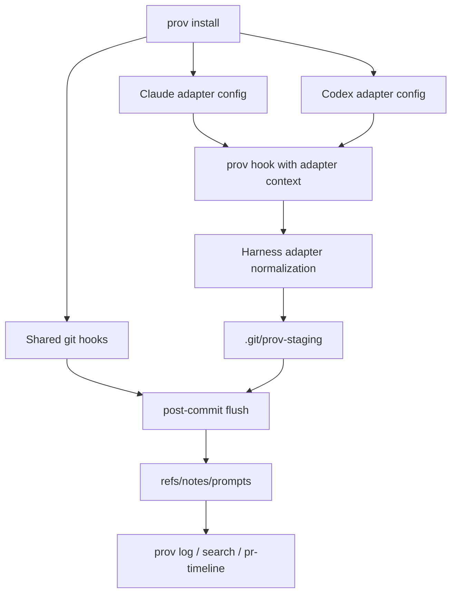

# feat: Add agent harness adapters

## Summary

Generalize Prov's Claude-specific capture path into explicit harness adapters, then add Codex as the first non-Claude adapter. The plan keeps the existing git-note pipeline intact, makes per-repo agent hook installation explicit, and updates docs/tests so Prov presents as agent-harness-agnostic provenance.

---

## Problem Frame

The current installer, hook parser, docs, and tests assume Claude Code is the only agent harness. The origin document reframes Prov as agent provenance across harnesses, with Codex as the first proof point.

---

## Requirements

- R1. Public language describes Prov as agent-harness-agnostic provenance, not Claude Code provenance with add-ons.
- R2. Claude Code remains a first-class supported adapter.
- R3. Codex is the first non-Claude adapter and is treated as the proof that Prov can support more than one harness.
- R4. Codex-captured provenance is queryable through the same `prov log`, `prov search`, and cache-backed read surfaces as Claude-captured provenance.
- R5. Codex capture follows the same privacy and non-blocking posture as Claude capture.
- R6. Per-repo installation lets users explicitly choose which agent adapter hooks to install.
- R7. Binary/remote install paths do not mutate repo hooks or agent configuration.
- R8. Install output clearly reports installed, skipped, and follow-up adapter actions.
- R9. Prov defines a harness adapter contract for identifying the harness, normalizing prompt/session/edit context, and visibly degrading when context is insufficient.
- R10. Cursor and Pi remain future adapters until validated.

**Origin actors:** A1 Prov user, A2 downstream coding agent, A3 Prov maintainer, A4 agent harness.
**Origin flows:** F1 per-repo adapter setup, F2 Codex provenance capture, F3 future adapter evaluation.
**Origin acceptance examples:** AE1 Codex provenance query, AE2 selective adapter install, AE3 remote installer does not mutate configs, AE4 future adapter evaluation.

---

## Scope Boundaries

- Cursor and Pi adapters are not implemented in this plan.
- Codex plugin packaging is not implemented; this plan covers repo-local Codex hook setup.
- Global auto-detection that installs every available adapter by default is not implemented.
- Remote `curl | sh` installer behavior is not expanded into a repo/config wizard.
- Git notes storage, sync, redaction, and post-commit matching remain unchanged except where capture records need harness-neutral language.
- Hosted service, telemetry, account-based registry, and cross-machine adapter distribution are out of scope.

### Deferred to Follow-Up Work

- Codex plugin packaging: revisit after repo-local Codex capture is proven.
- Cursor adapter evaluation: validate local, CLI, and cloud hook behavior against the adapter contract before planning implementation.
- Pi adapter evaluation: validate extension packaging and lifecycle fidelity before planning implementation.

---

## Context & Research

### Relevant Code and Patterns

- `crates/prov-cli/src/commands/install.rs`: idempotent git hook installation, `.claude/settings.json` merge behavior, atomic JSON writes, and install output.
- `crates/prov-cli/src/commands/uninstall.rs`: reverse path for hook blocks, Claude settings cleanup, and purge behavior.
- `plugin/hooks/hooks.json`: current Claude hook registration source embedded by the installer.
- `crates/prov-cli/src/commands/hook.rs`: hidden hook dispatcher and Claude payload parsing for prompt, session, edit, and stop events.
- `crates/prov-core/src/storage/staging.rs`: harness-agnostic enough staging structure, but comments and record semantics are still Claude-oriented.
- `crates/prov-core/src/schema.rs`: durable note schema already has `tool` as the harness discriminator; comments and tests currently assume `"claude-code"`.
- `crates/prov-cli/tests/cli_read.rs`, `crates/prov-cli/tests/hook_capture.rs`, and `crates/prov-cli/tests/cli_plugin_layout.rs`: main regression coverage for install behavior, capture behavior, and plugin hook shape.

### Institutional Learnings

- `docs/solutions/conventions/defensive-default-polarity-conventions-2026-05-03.md`: avoid silent provenance loss; nullable or missing dedupe components need structural discriminators; write/admin CLI surfaces should be agent-readable.
- `docs/solutions/conventions/git-subprocess-hardening-conventions-2026-05-02.md`: hook handlers must cap stdin reads, preserve literal command hints, and keep git/config operations non-interactive and hard to misuse.

### External References

- OpenAI Codex hooks docs: `https://developers.openai.com/codex/hooks`. Relevant planning constraints: hooks require `[features] codex_hooks = true`; Codex loads hooks from user and project `.codex` config layers; matching hook sources are additive; project-local hooks load only when the project `.codex/` layer is trusted; command hooks receive JSON on stdin; commands run with the session `cwd`; `PostToolUse` supports `apply_patch` with `Edit`/`Write` matcher aliases.

---

## Key Technical Decisions

- Adapter selector on hidden hook dispatch: New hook registrations should identify their harness adapter, while old `prov hook <event>` invocations continue to default to Claude so existing installed Claude configs do not break.
- Explicit install flags over prompts: `prov install` should stay non-interactive and scriptable. Adapter selection should use a repeatable `--agent <claude|codex>` option plus an `all` convenience value; no adapter flag installs shared git hooks only and reports that no agent adapter hooks were installed.
- Core git hooks remain shared: `.git/hooks/post-commit`, `pre-push`, and `post-rewrite` are installed once per repo and are not duplicated per agent adapter.
- Codex uses project-local config: Codex hook setup should write repo-local `.codex` config because the origin requires per-repo trust and avoids global surprise.
- Note schema version should stay stable if possible: Use the existing `tool` field as the harness discriminator and generalize docs/comments/tests. Bump only if implementation discovers an incompatible persisted data need.
- Codex edit parsing starts narrow: Treat Codex file edits through `apply_patch` as the first supported edit capture path, because official docs identify `apply_patch` as the file-edit tool surfaced to hooks.

---

## Open Questions

### Resolved During Planning

- Exact normalized event model: Reuse the existing staged turn/edit/session model, add an adapter layer that maps harness payloads into it, and keep durable notes harness-neutral via `tool`.
- Command interface for adapter install/status: Use repeatable `--agent <claude|codex>` selection, an `all` convenience value, shared git-hook install when no adapter is selected, and clear install/uninstall output rather than interactive detection in this plan.
- Minimum evidence for future adapters: Require documented or empirically verified prompt/session/edit lifecycle coverage, non-blocking behavior, privacy compatibility, and fixtures before declaring support.

### Deferred to Implementation

- Codex `apply_patch` payload details: Use official docs for the event contract, but pin the exact observed JSON shape with fixtures and tests during implementation.
- Codex trust-state UX: Implementation should report when project-local Codex hooks were written, but whether Codex currently trusts the `.codex/` layer may require runtime behavior that is better verified manually.
- Existing-user migration wording: Final CLI copy can be adjusted during implementation after seeing the exact install output layout.

---

## High-Level Technical Design

> *This illustrates the intended approach and is directional guidance for review, not implementation specification. The implementing agent should treat it as context, not code to reproduce.*

The adapter layer is intentionally before staging. Staging, post-commit flush, notes, cache, and read surfaces should not fork per harness unless a future adapter proves the shared model is insufficient.

---

## Implementation Units

### U1. Generalize Product Language And Durable Metadata Semantics

**Goal:** Remove Claude-only positioning from user-facing docs, CLI descriptions, schema comments, and read-rendering language while preserving Claude as a named supported adapter.

**Requirements:** R1, R2, R4, R9

**Dependencies:** None

**Files:**
- Modify: `README.md`
- Modify: `plugin/README.md`
- Modify: `plugin/skills/prov/SKILL.md`
- Modify: `crates/prov-cli/src/main.rs`
- Modify: `crates/prov-core/src/schema.rs`
- Modify: `crates/prov-cli/src/render/timeline.rs`
- Test: `crates/prov-core/src/schema.rs`
- Test: `crates/prov-cli/tests/cli_smoke.rs`
- Test: `crates/prov-cli/tests/cli_read.rs`

**Approach:**
- Reword public positioning from "Claude Code-driven edit" to "AI agent / harness-driven edit" where the statement is now broader.
- Keep Claude-specific wording only where the surface is actually Claude-specific, such as the Claude plugin and Claude Skill.
- Treat `tool` as the durable harness discriminator in docs and fixtures rather than a field that is expected to always be `"claude-code"`.
- Update stale CLI long-description claims while touching positioning, especially any reviewer/GitHub Action language that no longer matches current product scope.

**Patterns to follow:**
- `docs/plans/2026-05-07-001-refactor-unship-pr-comment-action-plan.md` for keeping README claims honest when a surface does not ship.
- Existing JSON roundtrip tests in `crates/prov-core/src/schema.rs`.

**Test scenarios:**
- Happy path: schema roundtrip accepts and preserves a non-Claude `tool` value.
- Happy path: CLI smoke/help output describes agent provenance without naming only Claude in the top-level product description.
- Regression: Claude-specific plugin docs still describe Claude plugin installation accurately.

**Verification:**
- A grep for Claude-oriented language leaves only intentional Claude-specific surfaces or historical docs.
- Existing notes with `"tool": "claude-code"` remain parseable and readable.

---

### U2. Introduce Harness Adapter Dispatch Boundaries

**Goal:** Make hook handling adapter-aware without duplicating the entire capture pipeline.

**Requirements:** R2, R3, R4, R5, R9

**Dependencies:** U1

**Files:**
- Modify: `crates/prov-cli/src/commands/hook.rs`
- Modify: `crates/prov-core/src/storage/staging.rs`
- Modify: `crates/prov-core/src/session.rs`
- Test: `crates/prov-cli/tests/hook_capture.rs`
- Test: `crates/prov-core/tests/storage.rs`

**Approach:**
- Add a harness adapter choice at the hook-dispatch boundary while preserving current hook invocations as Claude-compatible.
- Normalize each adapter's prompt/session/edit/stop payloads into the existing staging records.
- Keep redaction and private-routing behavior in the shared path so every adapter gets the same privacy posture.
- Make missing adapter-specific fields degrade to log-and-skip behavior, not panics or blocked agent loops.
- Keep staging layout unchanged unless implementation discovers a concrete collision that requires a small additive field.

**Execution note:** Add characterization coverage for current Claude hook behavior before changing dispatch shape.

**Patterns to follow:**
- Defensive hook contract in `crates/prov-cli/src/commands/hook.rs`: hook failures log and exit success.
- Staging file mode and append-only patterns in `crates/prov-core/src/storage/staging.rs`.
- Nullable dedupe guidance in `docs/solutions/conventions/defensive-default-polarity-conventions-2026-05-03.md`.

**Test scenarios:**
- Happy path: existing Claude `prov hook user-prompt-submit`, `post-tool-use`, `session-start`, and `stop` invocations still stage the same records.
- Happy path: adapter-qualified Claude invocations produce equivalent staged records to legacy invocations.
- Error path: unknown adapter or malformed adapter payload exits successfully and writes a diagnostic log entry without staging invalid edits.
- Edge case: missing optional session/model fields do not prevent staging prompt and edit records when required correlation fields are present.

**Verification:**
- Existing hook capture tests pass unchanged or with only expectation updates for generalized wording.
- New dispatch tests prove the compatibility default and the adapter-qualified path.

---

### U3. Add Explicit Agent Adapter Installation

**Goal:** Change `prov install` and `prov uninstall` so agent hook wiring is selected explicitly and reversible per repo.

**Requirements:** R2, R6, R7, R8

**Dependencies:** U2

**Files:**
- Modify: `crates/prov-cli/src/commands/install.rs`
- Modify: `crates/prov-cli/src/commands/uninstall.rs`
- Modify: `crates/prov-cli/src/main.rs`
- Test: `crates/prov-cli/tests/cli_read.rs`
- Test: `crates/prov-cli/tests/cli_smoke.rs`

**Approach:**
- Separate shared git hook installation from agent adapter configuration in the installer.
- Add repeatable explicit adapter selection for Claude and Codex, plus an all-supported-adapters value; no unsupported future adapter should silently install.
- Treat an omitted adapter selection as shared git-hook setup only, with output that tells the user no agent adapter hooks were installed.
- Make the no-agent or skipped-agent state visible in install output so users know whether capture will fire in their harness.
- Extend uninstall to remove Prov-owned Claude and Codex adapter config while preserving unrelated user config.
- Keep `prov install --plugin` informational and non-mutating for repo config, matching the current trust boundary.

**Patterns to follow:**
- Existing sentinel-block hook merge in `install.rs` and cleanup in `uninstall.rs`.
- Existing `.claude/settings.json` preservation and legacy self-healing tests in `cli_read.rs`.
- Atomic JSON writing in `install.rs`.

**Test scenarios:**
- Happy path: installing with only Claude writes shared git hooks and Claude adapter config, but no Codex config.
- Happy path: installing with only Codex writes shared git hooks and Codex adapter config, but no Claude config.
- Happy path: installing with both supported adapters writes both adapter configs and only one shared git hook block per git hook file.
- Happy path: installing with no selected adapters writes shared git hooks and cache/config basics but no agent config, and reports follow-up adapter commands.
- Regression: re-running install with the same adapters is idempotent and does not duplicate hook entries.
- Regression: unrelated user Claude and Codex config keys survive install and uninstall.
- Error path: requesting an unsupported adapter fails cleanly before writing partial adapter config.
- AE2: choosing only Codex leaves Claude capture untouched and reports the adapter choice clearly.
- AE3: the plugin/binary-info install path does not modify `.git/hooks`, `.claude`, or `.codex`.

**Verification:**
- Installer output names shared git hooks, installed adapters, skipped adapters, and follow-up commands.
- Uninstall round-trips all Prov-owned adapter config without deleting user-owned config.

---

### U4. Implement Repo-Local Codex Hook Configuration

**Goal:** Wire Codex project-local hooks so Codex can call Prov during the same lifecycle points used by Claude capture.

**Requirements:** R3, R5, R6, R8, R9

**Dependencies:** U2, U3

**Files:**
- Create: `codex/hooks/hooks.json`
- Modify: `crates/prov-cli/src/commands/install.rs`
- Modify: `crates/prov-cli/src/commands/uninstall.rs`
- Test: `crates/prov-cli/tests/cli_codex_layout.rs`
- Test: `crates/prov-cli/tests/cli_read.rs`

**Approach:**
- Add a repo-owned Codex hook template that registers `SessionStart`, `UserPromptSubmit`, `PostToolUse`, and `Stop` for the Prov capture flow.
- Ensure project-local Codex config also enables the Codex hooks feature required by official docs.
- Use Codex's documented matcher aliases for file edits through `apply_patch`, so Prov captures the intended edit tools without matching unrelated tool categories.
- Resolve hook commands from the git root or otherwise use stable paths/commands so Codex sessions launched from subdirectories still work.
- Include status/output choices that keep Codex hook behavior non-blocking and quiet during normal capture.

**Patterns to follow:**
- `plugin/hooks/hooks.json` for the current Claude hook template shape.
- `crates/prov-cli/tests/cli_plugin_layout.rs` for static hook-template validation.
- OpenAI Codex hooks docs for feature flag, config locations, matcher behavior, and command working directory.

**Test scenarios:**
- Happy path: Codex hook template includes the expected lifecycle events and commands that identify the Codex adapter.
- Happy path: installing Codex creates or merges repo-local Codex config without removing unrelated keys.
- Happy path: Codex `PostToolUse` matcher targets file-edit events, including the documented `apply_patch` aliases.
- Regression: install remains idempotent when both Codex hook config and Codex feature config already exist.
- Error path: invalid existing Codex JSON/TOML config fails with a clear message and does not overwrite user content.

**Verification:**
- A repo configured with Codex adapter has the feature flag and hook definitions Codex requires.
- Codex setup output mentions that project-local hooks load only when the `.codex/` layer is trusted.

---

### U5. Normalize Codex Prompt And Edit Payloads

**Goal:** Convert Codex hook payloads into the same staged turn/edit records used by Claude so read surfaces do not fork by harness.

**Requirements:** R3, R4, R5, R9

**Dependencies:** U2, U4

**Files:**
- Modify: `crates/prov-cli/src/commands/hook.rs`
- Add: `crates/prov-core/tests/fixtures/hook-payloads/codex-user-prompt-submit.json`
- Add: `crates/prov-core/tests/fixtures/hook-payloads/codex-session-start.json`
- Add: `crates/prov-core/tests/fixtures/hook-payloads/codex-post-tool-use-apply-patch.json`
- Add: `crates/prov-core/tests/fixtures/hook-payloads/codex-stop.json`
- Test: `crates/prov-cli/tests/hook_capture.rs`

**Approach:**
- Use Codex common fields for session id, model, transcript path, cwd, and turn id where available.
- Preserve Prov's existing conversation/turn model, mapping Codex identifiers into it consistently enough for dedupe and post-commit flush.
- Parse Codex `UserPromptSubmit` prompt text through the same private marker and redaction behavior as Claude.
- Parse Codex `PostToolUse` file-edit events narrowly at first, with explicit tests for the observed `apply_patch` payload shape.
- Set the staged/durable `tool` value to identify Codex captures distinctly from Claude captures.
- Avoid transcript parsing assumptions unless Codex transcript shape is empirically pinned; prefer payload-provided `model` when available.

**Execution note:** Start with fixture-driven characterization tests from captured or documented Codex hook payloads before changing parser behavior.

**Patterns to follow:**
- Existing Claude fixture-driven tests in `crates/prov-cli/tests/hook_capture.rs`.
- `read_stdin_json` payload cap and non-blocking failure policy in `hook.rs`.
- Existing model fallback tests in `hook_capture.rs`.

**Test scenarios:**
- Happy path: Codex prompt submission creates a turn record with redacted prompt text and Codex session identity.
- Happy path: Codex session start captures model metadata when provided.
- Happy path: Codex `apply_patch` edit payload creates an edit record with repo-relative file path, content hashes, tool-use correlation when available, and `tool` identifying Codex.
- Happy path: Codex stop finalizes the current turn without producing stdout that Codex treats as invalid.
- Edge case: Codex sessions launched from a subdirectory still store repo-relative file paths.
- Error path: Codex non-file tool events are ignored rather than creating bogus edits.
- Error path: malformed Codex hook JSON exits success, logs the failure, and does not block Codex.
- AE1: after Codex prompt/edit/commit simulation, `prov log` identifies Codex provenance through the normal read path.

**Verification:**
- Codex and Claude capture tests both pass through the same post-commit flush and read assertions.
- No read command needs a Codex-specific code path to display captured prompt provenance.

---

### U6. Update Manual Validation And Adapter Readiness Documentation

**Goal:** Make the new adapter posture understandable and give maintainers a repeatable bar for Codex verification and future harness evaluation.

**Requirements:** R1, R8, R10

**Dependencies:** U3, U4, U5

**Files:**
- Modify: `docs/dogfooding.md`
- Modify: `docs/follow-ups.md`
- Modify: `README.md`
- Modify: `plugin/README.md`
- Add: `docs/solutions/conventions/agent-harness-adapter-readiness-2026-05-10.md`

**Approach:**
- Add a Codex dogfooding path that covers install, session restart/trust caveats, prompt/edit capture, commit flush, and `prov log`.
- Document the adapter readiness bar: lifecycle coverage, payload fixtures, privacy behavior, non-blocking behavior, install reversibility, and read-surface parity.
- Update follow-ups so Cursor and Pi are future adapter evaluations with concrete validation questions, not active implementation promises.
- Keep Claude plugin docs clearly Claude-specific while broader README docs describe Prov as agent-harness-agnostic.

**Patterns to follow:**
- Existing `docs/dogfooding.md` install and hook-capture smoke sections.
- Existing `docs/solutions/conventions/*.md` frontmatter and guidance style.

**Test scenarios:**
- Test expectation: none for prose-only docs, but every command or flag named in docs must correspond to an implemented CLI surface or be explicitly marked as future work.

**Verification:**
- Manual validation steps cover both Claude and Codex adapter setup.
- Cursor and Pi appear only as deferred/evaluation work, not as shipped adapters.

---

## System-Wide Impact

- **Interaction graph:** `prov install` now configures shared git hooks plus selected adapter config; hook dispatch routes through adapter normalization before writing existing staging files.
- **Error propagation:** Agent hook failures remain non-blocking; install/config parse failures remain normal CLI errors because they happen before agent runtime.
- **State lifecycle risks:** Multiple adapters can write into the same staging tree. Session id and turn-index handling must avoid collisions and must not collapse edits when optional tool-use ids are missing.
- **API surface parity:** `prov log`, `prov search`, `prov pr-timeline`, cache reindex, sync, and notes resolution should continue reading the same durable note schema.
- **Integration coverage:** Unit tests for config and parsing are not enough; at least one end-to-end fixture should drive Codex-style prompt/edit/commit/read behavior through the existing post-commit flush.
- **Unchanged invariants:** Notes remain local-only by default; shared git hook blocks remain idempotent; private prompt routing and redaction stay shared across adapters.

---

## Risks & Dependencies

| Risk | Mitigation |
|------|------------|
| Codex hook payload shape differs from docs or changes quickly | Pin observed payload fixtures and keep parser failure non-blocking with diagnostic logs |
| Existing Claude users lose capture after installer changes | Preserve legacy hook command compatibility, document explicit Claude adapter install, and cover Claude install in regression tests |
| Two adapters create staging collisions | Include harness/tool identity in normalized records where needed and test sessions with missing optional tool-use ids |
| Codex project-local hooks do not load because the project layer is untrusted | Report the trust caveat in install output and dogfooding docs; treat runtime trust verification as manual validation |
| Config merge corrupts user `.codex` files | Use structured parsing, preserve unrelated keys, atomic writes, and fail cleanly on invalid existing config |
| Public docs overclaim Cursor/Pi support | Keep future harnesses in deferred/evaluation language and add grep-oriented documentation review before shipping |

---

## Documentation / Operational Notes

- Update quick start examples to show explicit adapter installation for Claude and Codex.
- Keep remote installer documentation narrow: binary installation only, followed by per-repo setup.
- Add a release note warning that per-repo agent adapter selection is explicit and existing users should verify which adapters are installed.
- Manual QA should include restarting or reopening each harness after config changes because both Claude and Codex load hook config at session startup/trust boundaries.

---

## Sources & References

- **Origin document:** [docs/brainstorms/2026-05-10-agent-harness-agnostic-provenance-requirements.md](../brainstorms/2026-05-10-agent-harness-agnostic-provenance-requirements.md)
- Related code: `crates/prov-cli/src/commands/install.rs`
- Related code: `crates/prov-cli/src/commands/uninstall.rs`
- Related code: `crates/prov-cli/src/commands/hook.rs`
- Related code: `crates/prov-core/src/schema.rs`
- Related code: `crates/prov-core/src/storage/staging.rs`
- Related docs: `docs/solutions/conventions/defensive-default-polarity-conventions-2026-05-03.md`
- Related docs: `docs/solutions/conventions/git-subprocess-hardening-conventions-2026-05-02.md`
- External docs: [OpenAI Codex hooks](https://developers.openai.com/codex/hooks)
